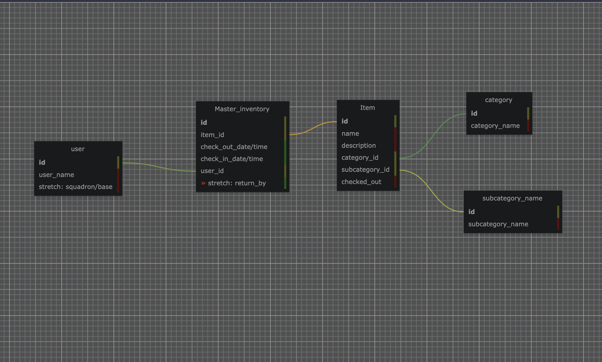

# Project 3

## Planning:
- Github: https://github.com/jangoflyte/Project-3
- Trello: https://trello.com/b/CZnbSZrL/project-3 
- Figma: https://www.figma.com/file/1HjLFW5m19RylK1Kx0hKf9/Untitled?node-id=0%3A1 
- Word Doc: https://docs.google.com/document/d/1hlCnAcFzcLfWCOGo9BSLi8VJD8x6sclpCxnRINSJyDo/edit

Problem Statement (Supply): As a unit supply manager, I need a system that can orderly track all items of inventory that are assigned to the base/squadron. This system needs to track all users who check out inventory as well as track the date it was assigned, with the ability to put a date of return. 

### Schema:

### Final Presentation: 
https://docs.google.com/presentation/d/14de-_tFoO-i9lwFASVCFwJrv8dL-kcsG4ccOv8_rYuk/edit#slide=id.p 

## Installation:

### Database
1. Ensure that you have installed postgres in a Docker container and psql inside the postgres image
-- important: `docker run --rm --name pg-docker -e POSTGRES_PASSWORD=docker -d -p 5432:5432 \
-v $HOME/docker/volumes/postgres:/var/lib/postgresql/data postgres`
2. Install the database by importing the sql file in postgres from the path specified by running:
`docker cp path/Project-3/server/inventory.sql <container id>:/tmp/inventory.sql`
3. A database can also be manually made inside psql by running the query:
`CREATE DATABASE inventory_project_3`
4. Ensure knex migrations and seeds are run by running the following commands:
`cd server`
`npx knex migrate:latest`
`npx knex seed:run`

### Server
1. To spin up the server, ensure all dependencies are installed
`cd server`
`npm i`
2. Run the server by: `npm start`

### Front End
1. To spin up the front end ensure all dependencies are installed
`cd inventory-tracker-app`
`npm i`
2. Run the server by: `npm start`

## Purpose
The purpose of this application is to serve as a inventory tracker for a military unit.
